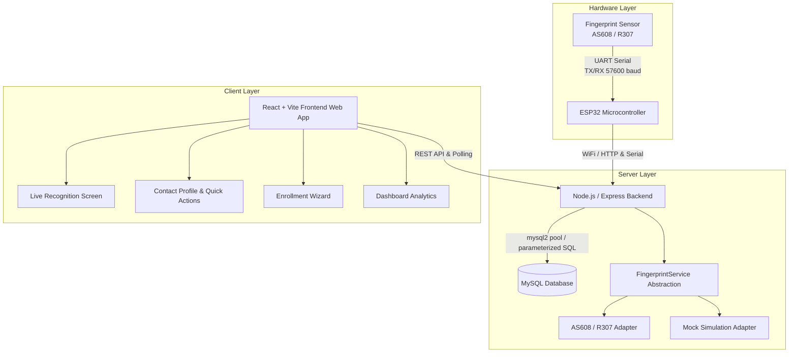

# Contact Recognition App Using Fingerprint Sensor

[](https://opensource.org/licenses/MIT)
[](https://nodejs.org/)
[](https://react.dev/)
[](https://www.espressif.com/)

A production-grade, full-stack biometric contact recognition and identification platform. The system connects an **ESP32 microcontroller** with optical fingerprint sensors (**AS608 / R307**) over UART to enroll contact fingerprints and perform real-time biometric identification, instantly pulling up contact profiles with one-touch Call, WhatsApp, and Email actions.

---

## 🌟 Key Features

- **Biometric Identification**: Real-time identification of enrolled fingers mapped to contact profiles.
- **Hardware Abstraction Layer**: Dual-mode architecture supporting both real ESP32/AS608/R307 hardware and zero-dependency software mock mode for development.
- **Contact Management**: Comprehensive CRUD operations with search, filtering, tagging, and quick communication actions (Call, WhatsApp, Email).
- **Biometric Enrollment Wizard**: Guided interactive multi-step fingerprint capture and verification.
- **Analytics & History**: Live dashboard metrics, recognition charts, and audit logs.
- **Device Management**: ESP32 device health, status monitoring, template synchronization, and heartbeat.
- **Security & Privacy**: Zero raw fingerprint image storage; sensor template slot IDs are securely mapped in MySQL; JWT authentication; rate limiting and SQL injection protection.

---

## 🏗️ System Architecture



---

## 🚀 Quick Start

### Prerequisites
- Node.js (v18+)
- MySQL (v8+) or use Built-in Mock Mode
- (Optional for Hardware) ESP32 Development Board + AS608 or R307 Fingerprint Module

### Installation

1. Clone repository:
```bash
git clone https://github.com/ruthwin09/Contact-Recognition-App-Using-Fingerprint-Sensor.git
cd Contact-Recognition-App-Using-Fingerprint-Sensor
```

2. Install dependencies:
```bash
npm run install:all
```

3. Configure environment variables:
```bash
cp .env.example .env
cp server/.env.example server/.env
```

4. Run in Development Mode:
```bash
npm run dev
```

The frontend will be available at `http://localhost:5173` and backend API at `http://localhost:5000`.

---

## 📚 Documentation

- [Architecture Overview](docs/architecture.md)
- [API Reference](docs/api.md)
- [Hardware Wiring & Setup](docs/hardware.md)
- [Database Schema & Seed](docs/database.md)
- [Development Guide](docs/development.md)

---

## 📄 License
This project is licensed under the MIT License - see the [LICENSE](LICENSE) file for details.
